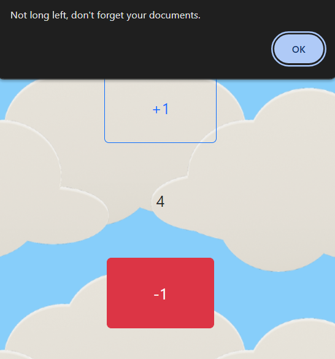

<h1 align="center">Hi 👋, I'm Fabio</h1>
<h3 align="center">A passionate frontend developer from Italy</h3>

- 🔭 I’m currently working on [Journey-Counter]
- [journey-counter.netlify.app](https://journey-counter.netlify.app/)

<h2>This small application helps you take into account how many days are left until your trip and gives you some little advice as your departure approaches.</h2>

This is one of the warnings that you can find within the application ;)

<h3 align="left">Languages and Tools:</h3>

    

